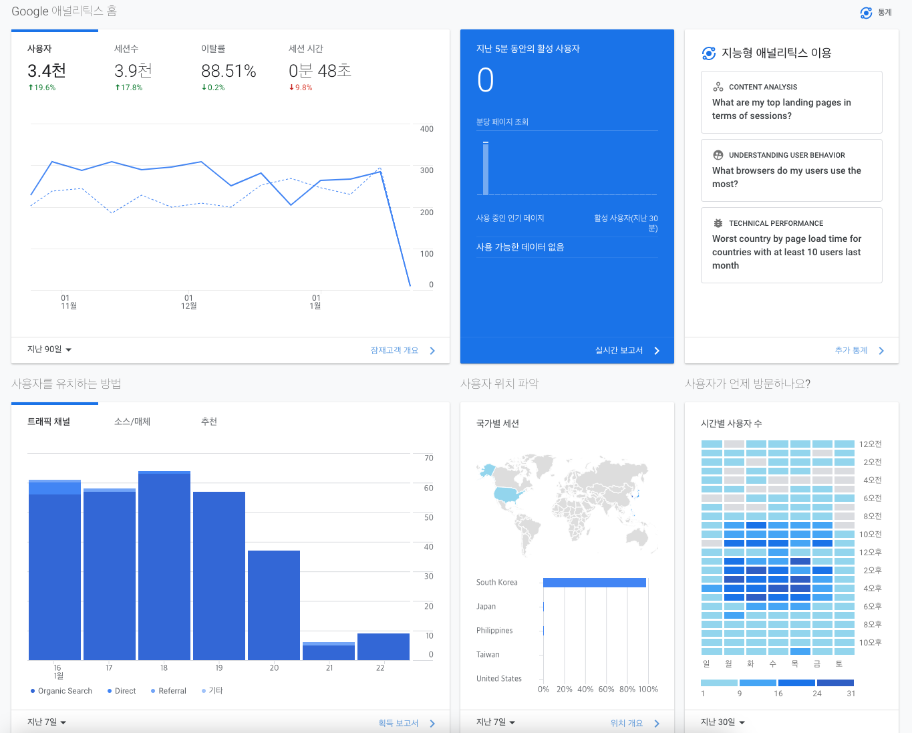

현재 기준 작년, 2022년에 한 해를 알차게 보내기 위해 다른 사람과 마찬가지로 `새해 목표` 를 세웠었다.  
처음에는 스타벅스에서 받은 다이어리에 손글씨로 열심히 작성했다. 하지만 "목표" 라고 세웠던 것들이 세우고 나면 기억에서 사라져서 한참 뒤에 다시 쳐다보게 되서 계획했던 것들을 사실은 시작도 못한 것이 많았다.

그래서 손으로 썼던 것을 다시 노션으로 옮겼고, 나만의 대시보드를 만들어서 관리하기 시작했다. 결론적으로는 상당히 만족한다. 이 노션 대시보드를 조금 더 다듬어서 2023년 말에는 템플릿으로 만드는 날이 왔으면 좋겠다.

<figure>
	
	<figcaption>Maylin's Dashboard preview</figcaption>
</figure>

다시 블로그를 시작한 이유는 나 혼자만 계획을 세우고, 실천하고, 회고하는 것은 원동력이 없어서 재미도 없고 뿌듯함을 못느꼈기 때문이다. 어쩌면 개인적인 일을 왜 사람들과 공유해? 라고 생각할 수도 있지만, 블로그에 기록하는 것과 같이 공개적으로 글을 쓰는 것 자체만으로도 목적의식과 성취감이 생기는 듯 하다.

먼저, 구글 AdSense 를 검토요청 해놓았다. 1년 가까이 방치해둔 블로그가 아직도 트래픽이 있는 것을 보고 다시 시작할 마음이 생겼기 때문이다. 감사하게도 생각보다 많은 유저들이 내 보잘 것 없는(?) 글을 읽어주셨다 :)

<figure>
	
	<figcaption>지난 7일 동안 Google Anaylitics 캡쳐</figcaption>
</figure>

대신, 이전에는 개발 관련된 내용만 포스팅을 했다면 올해에는 조금 더 일상적인 내용을 포스팅 하려고 한다. 가령 영화/드라마/뮤지컬 리뷰일수도 있고 여행 관련된 내용일 수도 있겠다.

지금 제일 글을 쓰며 정리하고 싶은 것은 노션에 대한 내용이다. 작년의 내 노션 대시보드에서 성취한 것은 무엇이고 어떤 것은 미흡했는지, 그래서 올해에 그것을 할지 아닐지를 정리하고 싶다.
