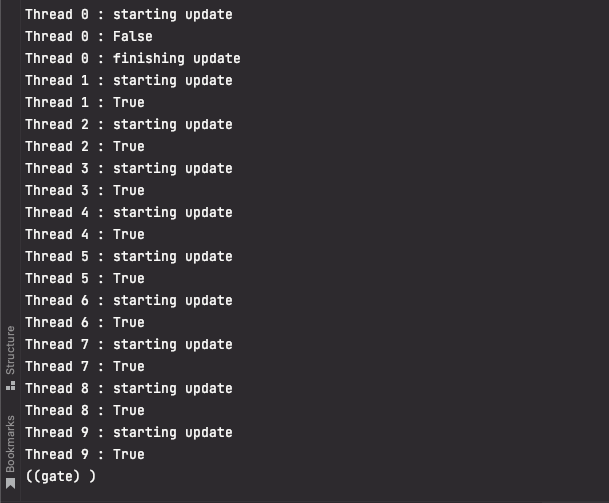
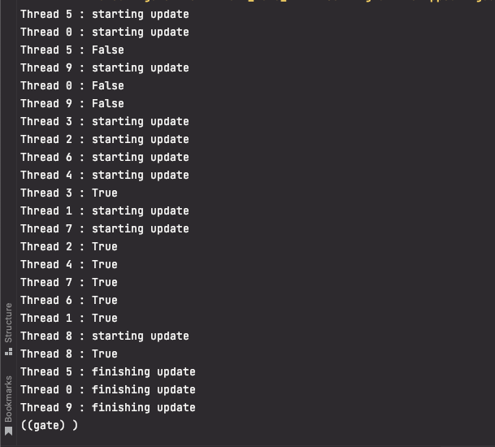
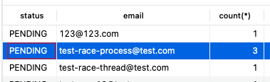
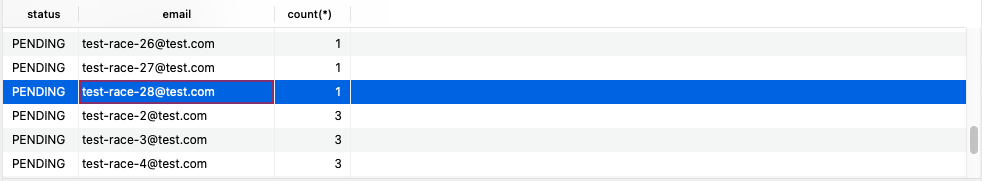

최근 회사에서 여러 보안 솔루션을 통해 Security 를 높이는 작업을 하고 있습니다. 리포트가 들어온 것 중에 Race Condition 관련된 티켓이 있었고, 어떻게 해결하는지에 대한 내용을 정리하려고 합니다.

## Background

> A race condition occurs when multiple threads can access shared data and they try to change it at the same time.

멀티 스레드 환경에서 일어나는 상황으로서, 각 스레드가 "공유된 데이터"를 접근해서 같은 시간에 데이터를 변경할 때 생기는 문제를 race condition (경합)이라고 부른다.
말 그대로 여러 스레드가 "경합"을 해서 데이터를 조작하고자 하는 것이다. [Exploiting a Race Condition Vulnerability](https://medium.com/@vincenz/exploiting-a-race-condition-vulnerability-3f2cb387a72) 이 글이 도움이 많이 되었다.
운영체제 수업을 들을 때 `mutex` 라는 것을 배웠는데, mutex 를 사용하면 이러한 동시성 문제를 해결할 수 있다. 아마 트랜잭션의 isolation을 조절하면 해결할 수도 있을 것이다.

일단 여기에서 race-condition이 왜 vulnerable 한지 알아보자. 마찬가지로 위의 글에서 예시를 따왔다.

일반적으로 race-condition 의 희생양은 특정 유저가 딱 한번 쓸 수 있는 쿠폰 코드, 초대 코드 등이다. 예를 들어, 내가 즐겨쓰는 A 쇼핑몰에서 친구 초대를 하면 50 포인트를 주는 마케팅을 하고 있다고 생각해보자. 그리고 (malcious 하게) 같은 쿠폰코드를 사용해서 여러 친구를 초대하므로써 부자가 될 생각이 있다고 가정해보자.

Requirements:
1. Two user accounts (user1, user2)
2. Turbo Intruder (BurpSuite's plugin)

Race-Condition 은 빠른 클릭으로 만드는게 아니라 Turbo Intruder 라는 스크립트를 통해서 수행한다. 1초당 30,000 request를 보낼 수 있는 툴이다.

user1 에서 받은 invite code를 따로 가입한 user2의 초대코드 입력하기에 여러번 때려 넣는 것이다!

만약 불쌍한 쇼핑몰 A 가 race condtion 에 대한 방어를 해두지 않았다면, 나는 단 한번의 쿠폰코드로 30,000 * 50 포인트를 버는 것이다.

## How to Prevent Race Condition

(Django, Mysql 기준으로 Investigate 합니다.)

자, 이제 race condition을 해커들이 어떻게 이용하는지 알아봤다. 우리는 개발자기 때문에 막아야한다. 어떻게 막아야 할까?

1. `get_or_create` 사용

django의 query_set 메서드 중에서 `get_or_create`는 주어진 조건에 만족하는 row 가 있다면 그것을 반환하고, 없을 경우에만 새로 생성해주는 일을 담당한다. [Django Docs](https://docs.djangoproject.com/en/4.0/ref/models/querysets/#get-or-create)
공식 문서에는 race condition 상황에서 이 메서드가 좋은 대안이 될거라고 적혀있다. 하지만 이것도 적혀있다.

> Warning
> This method is atomic assuming that the database enforces uniqueness of the keyword arguments (see unique or unique_together). If the fields used in the keyword arguments do not have a uniqueness constraint, concurrent calls to this method may result in multiple rows with the same parameters being inserted.

즉, get_or_create의 조건에 unique constraint가 걸려있지 않는 경우에는, 동일하게 race condition이 발생해서 여러 row 들이 생성될 수 있다는 얘기다.

위 내용에 대한 자세한 글은 아래에서 확인할 수 있다.
- https://adriennedomingus.medium.com/the-perils-of-get-or-create-race-conditions-485fc8fb2068
- https://www.qu3vipon.com/get-or-create-race-condition

실제로 회사 코드에서는 `get_or_create` 를 썼지만, race condition으로 인한 duplicated row 가 생성되었다. 만약, 비즈니스 로직이나 다른 이유로 unique index 를 추가하지 못한다면 어떻게 해야할까?

2. lock 을 건다

다시 정리하자면, 내가 하고 싶은 일은 이것이다.

```
1. select PENDING or QUEUED invitation
2. if exists at least one row
3. Don't create new invitation
```

A, B, C 스레드가 동시에 위의 로직을 수행한다고 했을 때, 세 개의 스레드가 동시에 (1) 을 수행했을 때 invitation 이 없다고 판단해서 (2), (3) 로직을 수행한다면 3개의 rows 가 생겨진다. 단 하나의 스레드가 이 트렌잭션을 시작했다면, 그 순간 lock 을 걸어서 그 어떤 스레드도 이 트랜잭션을 수행하지 못하게 막고 싶다. (대기 상태로 락을 걸게 해야한다)

여기서 Mysql (또는 다른 유형의 database) 의 lock 종류에 대해 짚고 넘어가야 한다.

- Read Locks
  - Read lock 이 테이블에 걸려있다면, 다른 세션에서는 read lock 이 풀릴 때까지 write 를 할 수는 없지만 읽을 수는 있다. 즉 다른 세션에서 read lock을 걸 수는 있다.
- Write Locks
  - Write lock 을 건 세션만 read, write 할 수 있으며 다른 세션은 read, write 를 하지 못한다.

read lock 은 shared lock, 그리고 write lock 은 exclusive lock 이라고도 불린다.

Aha! 그러면 우리는 race condition 이 생기는 곳에 write lock 을 걸어서 동시에 수행된 세션이 read 도 못하고 write 도 못하게 바꾸면 되겠다

django 에 `select_for_update` 가 있다. [Django Docs](https://docs.djangoproject.com/en/4.0/ref/models/querysets/#select-for-update) `SELECT ... FOR UPDATE` 를 수행하는 ORM 기능이다. Mysql 에서 `SELECT ... FOR UPDATE` 는 write lock 을 잡아준다.

``` python
from django.db import transaction

entries = Entry.objects.select_for_update().filter(author=request.user)
with transaction.atomic():
    for entry in entries:
        ...
```

- nowait (default=False)
  - True 라면, 락이 잡혔을 때 다른 트랜잭션이 기다리지 않고 바로 `DatabaseError`를 발생하게 된다. (non-blocking)
- skip_locked (default=False)
  - True 라면, 락이 잡힌 row를 무시하고 스킵해버린다.
- of (>=django 3.2 , MySQL 8.0.1+)
  - `select_for_update` 는 related objects 까지 lock 을 잡는다 (즉, FK로 지정된 model 까지 lock 이 걸림)
  - 이걸 원하지 않는다면 `of` 옵션을 써서 lock 을 걸고 싶은 테이블을 지정하면 된다.

## Test

자 이제, before / after 를 비교하기 위해 테스트 코드를 짜보자.

> Scenario
> 1. Invitation 테이블에 `get_or_create` 하는 로직
> 2. 동시에 여러 스레드로 (1) 의 로직을 수행

시나리오는 간단하다. 하지만 이것을 어떻게 재현해볼까 하다가, 파이썬 멀티스레드를 통해 concurrency 를 재현해봤다. (물론 이것도 쉽지는 않았다.)

먼저 시나리오를 이해하기 위해서는 파이썬에서 멀티스레딩 과 멀티프로세서를 이해해야 한다. [이 글](https://monkey3199.github.io/develop/python/2018/12/04/python-pararrel.html) 이 도움이 많이 되었다.

### GIL (Global Interpreter Lock)

> 언어에서 자원을 보호하기 위해 Lock 정책을 사용하고 그 방법 또한 다양하다. 파이썬에서는 하나의 프로세스 안에 모든 자원의 락을 글로벌하게 관리함으로써 한번에 하나의 쓰레드만 자원을 컨트롤하여 동작하도록 한다.

즉, 스레드를 여러개 생성해서 실행시키더라도 GIL 때문에 한번에 하나의 스레드만 계산을 실행한다는 것이다.

```python
jobs = []
threads = 10
for i in range(0, threads):
    thread = threading.Thread(target=self.invite(email, i)) # 멀티스레드
    jobs.append(thread)
```



10개의 스레드를 만들었는데, 순차적으로 수행되는 것을 볼 수 있다.


GIL 덕분에 자원 관리를 더 쉽게 할 수는 있지만, 멀티 코어가 있는 환경에서의 시나리오를 재현할 수가 없다. GIL 이 적용되는 것은 CPU 동작에서이고, 쓰레드가 CPU 동작을 마치고 I/O 작업을 실행하는 동안에는 다른 쓰레드가 CPU 동작을 동시에 실행할 수 있다.

이러한 상황에서 병렬로 CPU 동작까지 하고자 한다면 multiprocessing 을 써야 한다. 쓰레드 대신 프로세스를 만들어서 병렬로 동작하게 하는 것이다. 이번에는 멀티프로세서로 만들어보자

```python
jobs = []
threads = 10
for i in range(0, threads):
    # thread = threading.Thread(target=self.invite(email, i))
    process = multiprocessing.Process(target=self.invite, args=(email, i))
    jobs.append(process)
```



원하는 대로 스레드들이 무작위로(?) 병렬처리 된 것을 볼 수 있다.

다시 돌아와서, race-condition을 재현하고 싶으면 **멀티프로세서**를 써야 한다는 것을 알 수 있다!



멀티 프로세서를 이용해서 Invitation 을 생성하는 코드를 생성해봤을 때 위와 같이 중복으로 생성되는 것을 확인할 수 있다.   
자, 그러면 위에서 신나게 얘기했던 `select_for_update` 를 이용해서 이 문제를 해결해보자  

유효한 invitation을 체크하는 로직에 `select_for_update` 를 추가해서 해당 row 에 wirte lock 을 건다.

``` python
with transaction.atomic():
    is_invited = (
        Invitation.objects.select_for_update()
        .filter(
            email=email,
            status='PENDING'
        )
        .exists()
    )
```

그리고 다시 위의 테스트 스크립트를 실행해보면, 1개만 잘 생성된 것을 볼 수 있다.



하지만 아래 에러도 볼 수 있다. Lock이 걸렸고, wating lock 타임아웃이 걸려서 transaction 이 롤백된 것이다. 이게 운이 나쁘면.. (아마 높은 가능성으로) Dead Lock 에 걸릴 확률이 있다.
```
The above exception was the direct cause of the following exception:

MySQLdb._exceptions.OperationalError: (1205, 'Lock wait timeout exceeded; try restarting transaction')
```

따라서, 제일 좋은 것은 Unique Index 로 race condition 을 막아야하고, 피치 못할경우, 위와 같이 wirte lock 을 걸어야 하며, dead lock 을 대비해야한다!

---

## Other options

스프링에서는 어떻게 할까?

- Pessimistic locking
  - increase the isolation level of Spring transactions from (default) `READ_COMMITTED` -> `REPEATABLE_READ`
  ```
  @Transactional(isolation=Isolation.REPEATABLE_READ)
  public void yourBusinessMethod {
      ...
  }
  ```
  - 이럴 경우에 메소드가 시작된 순간부터 끝날때까지 아무도 데이터를 건드리지 않는 것을 보장할 수 있다. (insert는 가능하다. update만 안되는 것이다.. phantom reads)
  - 이 phantom reads 를 막으려면 isolation level을 `SERIALIZABLE`로 올리면 된다. 이 정도의 격리 수준은 performance cost 에 부담을 주는데, hang이 걸릴 수 있다.
- Optimistic locking
  - 만약 이런 data colision 이 rare 하게 발생한다면, 어플리케이션 레벨에서 관리하는 것이 맞다. 예를 들어, entity의 version을 넣고, 누군가가 수정한다면 version을 변경해서 추적하는 것이다.

나와 비슷한 상황에 있는 회사의 글을 찾았다! https://medium.com/in-the-weeds/fixing-a-race-condition-c8b475fbb994

How can we achieve data integrity without adding the constraint?

- Changing the transaction isolation level
- Periodically running a process that cleans up the data
- Using database locks


1. isolation level
위에서 봤던 것 처럼 `SERIALIZABLE` 로 isolation level 을 올리는 것이다. 이건 근데 메서드 레벨에서 가능한가?

2. Batch Job
클린징하는 batch는 있을 수 있지만, 쿠폰이 이미 발행되었는데, 이미 create 되었는데 삭제하는건 무의미한 것 같다.

3. Using database locks
위 글을 쓴 분은 이 방법을 통해 해결 했다. (뒤에 dead lock 문제가 있긴 하지만) business logic 안에서 Explicit 하게 lock 을 걸어서 해결하는 방법이다.
그 중에서 row-level write lock 을 target table에 두는 것이다. (organization_id 를 lock 하고, add_invitation(email))

4. redis 로 application level 의 lock 을 잡는 방식

나는 단순하게 redis의 key-value를 이용해서 락을 잡으려고 했는데, `setnx` 라는 것이 있다고 한다. set not exist 라는 의미로, 사용된다.

[redis sentx](https://techblog.yogiyo.co.kr/db-concurrency-%EC%96%B4%EB%94%94%EA%B9%8C%EC%A7%80-%EC%95%8C%EA%B3%A0-%EC%9E%88%EB%8B%88-559bfc4f59ee)


### Reference

https://stackoverflow.com/questions/23154610/how-to-implement-race-condition-at-database-level-with-spring-and-hibernate
https://techblog.yogiyo.co.kr/db-concurrency-%EC%96%B4%EB%94%94%EA%B9%8C%EC%A7%80-%EC%95%8C%EA%B3%A0-%EC%9E%88%EB%8B%88-559bfc4f59ee  
[[Django] Row Lock 동작방식](https://chrisjune-13837.medium.com/django-row-lock-%EB%8F%99%EC%9E%91%EB%B0%A9%EC%8B%9D-a2e05bb0eb90)  
[How to manage Concurrency in Django Models](https://hakibenita.com/how-to-manage-concurrency-in-django-models)  
[MySQL InnoDB lock & deadlock 이해하기](https://www.letmecompile.com/mysql-innodb-lock-deadlock/)  
[파이썬 멀티 쓰레드(thread)와 멀티 프로세스(process)](https://monkey3199.github.io/develop/python/2018/12/04/python-pararrel.html)
[MySQL Gap Lock 다시보기](https://medium.com/daangn/mysql-gap-lock-%EB%8B%A4%EC%8B%9C%EB%B3%B4%EA%B8%B0-7f47ea3f68bc)  
[Django get_or_create() 함수에서 발생한 MySQL Deadlock 이슈 해결하기](https://youngminz.netlify.app/posts/get-or-create-deadlock)
