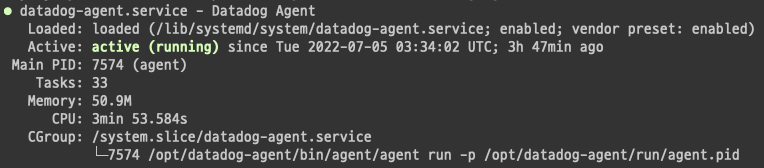

인프라팀에서 설치해준 data dog가 분명 작동을 했는데, 얼마전에 확인해보니 로그가 수집되고 있지 않았다. 생각해보니 예전에도 한번 이런적이 있어서 이유가 뭔지 찾아봤다.

먼저, nginx access log 가 실제로 잘 쌓이고 있는지 확인한다. 이건 각 환경에 따라 다를 것 같은데, ngnix 를 올리는 코드를 잘 찾아가보면 이런 코드를 볼 수 있을텐데, 여기서 `access_log` 경로를 찾고, 실제 해당 경로로 파일이 쌓이고 있는지 확인하면 된다.

```
server {
  listen 81;
  server_name localhost;

  access_log off;
  allow 127.0.0.1;
  deny all;

  location /nginx_status {
    # Choose your status module

    # freely available with open source NGINX
    stub_status;

    # for open source NGINX < version 1.7.5
    # stub_status on;

    # available only with NGINX Plus
    # status;

    # ensures the version information can be retrieved
    server_tokens on;
  }
}
```

필자의 경우 해당 경로의 access log 가 잘 쌓이고 있었다. 그러면 datadog 가 이 log를 수집을 못하고 있는게 된다.

## datadog 는 어떻게 로그를 수집하나?

- EC2 하나로 ngnix, django, worker 등이 다 올라가 있는 상황
- kubenetes container 사용하지 않음

Datadog Docs를 보니, 위와 같은 경우 host 인스턴스에 `datadog-agent` 를 설치한 뒤, 서비스를 활성시켜서 로그를 수집함을 알아냈다. 이건 공식문서에는 없고, datadog에 로그인해야 가이드가 보이는 것 같다.

그리고 서버에 들어가서 `datadog-agent` 가 설치되어 있는 것을 확인했다. [Basic Agent Usage for Amazon Linux](https://docs.datadoghq.com/agent/basic_agent_usage/amazonlinux/?tabs=agentv6v7) 문서에 보면 여러가지 커맨드가 있다.

`sudo systemctl status datadog-agent` 커멘드로 현재 상태가 어떤지 확인해본다.



문제없다! 그러면, `sudo datadog-agent status` 로 running Agent 의 detail status 를 확인해본다. CPU, Memory, Network 등등 여러가지 상태를 표시해주는데, 처음부터 끝까지 잘 읽어보자. 왜냐하면 답이 거기 있기 때문이다!

```
nginx
-----
  Type: file
  Path: /var/log/nginx/a.log
  Status: Error: open /var/log/nginx/a.log: permission denied
  BytesRead: 2.6668301e+07
```

필자는 여기서 `permission denied` 라는 message 에서 답을 찾았다. [Permission Issues](https://docs.datadoghq.com/agent/troubleshooting/permissions/?tabs=agentv63) 공식 문서에도 troubleshooting 으로 이 케이스가 나와있다.  
해결 방법은 `dd-agent` 로 access_log에 permission을 줘야 한다는 것이다.  
```
sudo chown -R dd-agent:dd-agent /var/log/datadog/
```

이렇게 해주니 datadog 에 access log 가 잘 수집되었다. 그런데, 몇 시간 뒤에 또 안보여서 다시 파일의 권한을 확인해보니, 내가 위에 `dd-agent` 로 권한을 줬던게 다시 원복되어 있었다. 누가 계속 이걸 바꾼단 말인가!

## logrotate

모든 답은 구글에 있다 ㅋㅋ 구글링을 해본 결과, linux 에서는 logrotate 를 이용해서 system log를 기록한다.

> logrotate is designed to ease administration of systems that generate large numbers of log files. It allows automatic rotation, compression, removal, and mailing of log files. Each log file may be handled daily, weekly, monthly, or when it grows too large.

`/etc/logrotate.d/nginx` 해당 파일을 view 해보면 아래와 같은 형태로 설정이 되어 있는데, 여기서 `create` 부분이 dd-agent 로 되어 있는지 확인하자.

```
# cat -n /etc/logrotate.d/nginx
1    /var/log/nginx/*log {
2    create 0644 nginx adm
3    daily
4    rotate 10
5    missingok
6    notifempty
7    compress
8    sharedscripts
9    postrotate
10      /bin/kill -USR1 `cat /run/nginx.pid 2>/dev/null` 2>/dev/null || true
11   endscript
12 }
```

필자는 위 부분을 `create 0644 dd-agent dd-agent`로 바꿨고, 정상 작동했다!

---
[Nginx permissions on access log rotation](https://stackoverflow.com/questions/60694773/nginx-permissions-on-access-log-rotation)
[How To Manage Logfiles with Logrotate on Ubuntu 16.04](https://www.digitalocean.com/community/tutorials/how-to-manage-logfiles-with-logrotate-on-ubuntu-16-04)
[logrotate(8) - Linux man page](https://linux.die.net/man/8/logrotate)
